# P2P Code Share

**P2P Code Share**는 별도의 중앙 서버 없이 WebRTC와 Yjs(CRDT)를 통해 VS Code 에디터 간에 실시간으로 소스 코드를 공유하고 동시 편집할 수 있는 확장 프로그램입니다.

- ⚡ **실시간 무손실 동시 편집**: 충돌 없이 여러 사용자가 같은 파일/같은 줄을 동시에 타이핑 및 병합
- 👥 **P2P 연결 & 커서 공유**: 방 이름만으로 자동 연결 및 참여자별 커서/선택영역 실시간 시각화
- 🔄 **작업 공간 세션 복원**: 호스트가 폴더를 전환하거나 창을 새로고침해도 끊김 없이 세션 및 게스트 자동 복귀
- 🛡️ **정밀한 권한 제어**: 참여자별 쓰기 권한 토글, 단독 파일 담당자 지정, 호스트 승인제

---

## 📖 사용 방법 가이드 (Usage Guide)

### 1. 방 개설하기 (호스트 - Host)

1. **사이드바 열기**: VS Code 좌측 액티비티 바에서 **P2P Code Share** 아이콘을 클릭합니다.
2. **방 생성**: **`Create Sharing Room`** 버튼을 클릭합니다.
3. **방 이름 설정**: 원하는 고유 방 이름(예: `my-team-project`)을 입력하고 **`START ENGINE`** 버튼을 누릅니다.
4. **연결 상태 확인**: 상단 배지가 `CONNECTED`로 바뀌면 방이 정상적으로 개설된 것입니다.

> [!CAUTION]
> **방 이름 중복 주의**:
> 다른 사용자가 이미 사용 중인 방 이름으로 방을 생성할 경우, 방 생성 자체는 완료되지만 하단에 **`"이미 사용 중인 방 이름입니다. 자동 연결 기능이 비활성화됩니다. 수동 SDP 복사 방식을 이용해주세요."`** 경고 메시지가 표시됩니다.
> 이 경우 게스트의 자동 참여(`JOIN (AUTO)`)가 불가능해지므로, **고유한 방 이름**(예: 영문/숫자 조합)을 사용하시거나 **수동 연결(`Invite Guest` -> `Join (Manual)`)** 방식을 이용해야 합니다.

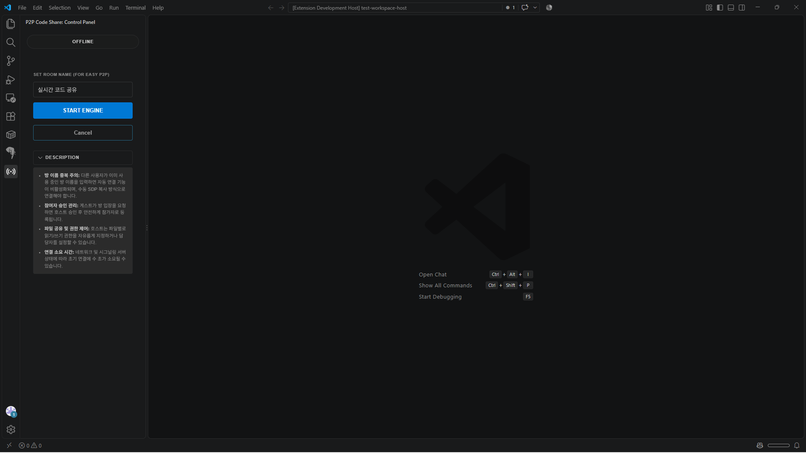  
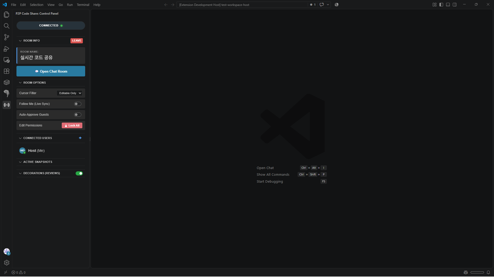  
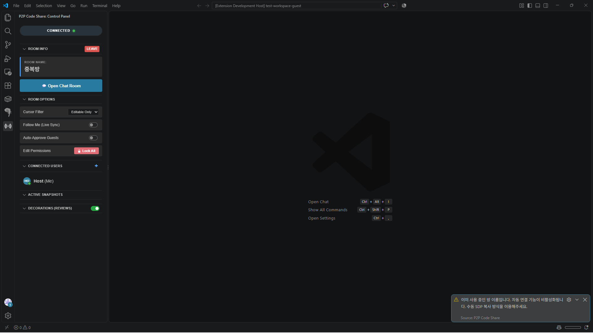

---

### 2. 파일 공유 및 중지

- **파일 공유하기**:
  - 공유하고 싶은 파일을 에디터에서 활성화(열기)한 뒤, 사이드바 상단의 **`Share Active File`** 버튼을 누릅니다.
  - 또는 탐색기(Explorer)에서 파일을 마우스 우클릭하고 **`P2P: Share File to Room`**을 선택합니다.
- **파일 열기**: 사이드바의 **Shared Files** 목록에서 파일 이름을 클릭하면 해당 공유 파일이 에디터로 열립니다.
- **공유 중지하기**: 사이드바의 파일 항목 우측에 있는 **`Stop`** 버튼을 누르면 공유가 중지되며, 게스트의 에디터에서도 안전하게 파일이 닫힙니다.

> [!NOTE]
> **파일 공유 중지 시 주의사항**:
> 호스트가 파일 공유를 중지(`Stop`)하면 게스트의 로컬 임시 파일도 자동으로 삭제 및 에디터에서 닫히도록 처리됩니다.
> 다만 OS 파일 잠금이나 에디터 상태에 따라 간헐적으로 게스트 측에 임시 복제 파일이 닫히지 않고 남아있는 경우가 발생할 수 있습니다.
> 이 파일은 게스트의 로컬 임시 복사본일 뿐이며, **이를 게스트가 직접 닫거나 삭제하더라도 호스트의 원본 소스 코드 파일에는 전혀 영향을 주지 않으므로** 안심하고 삭제하셔도 무방합니다.

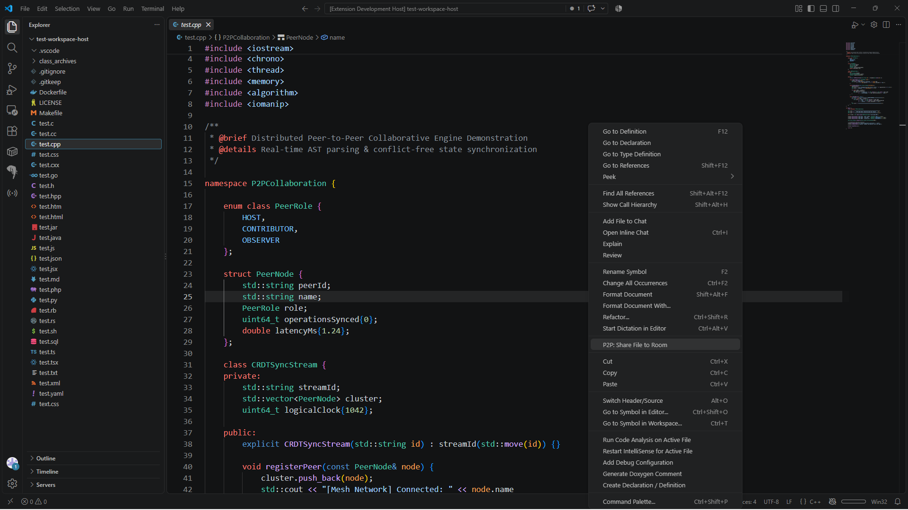  
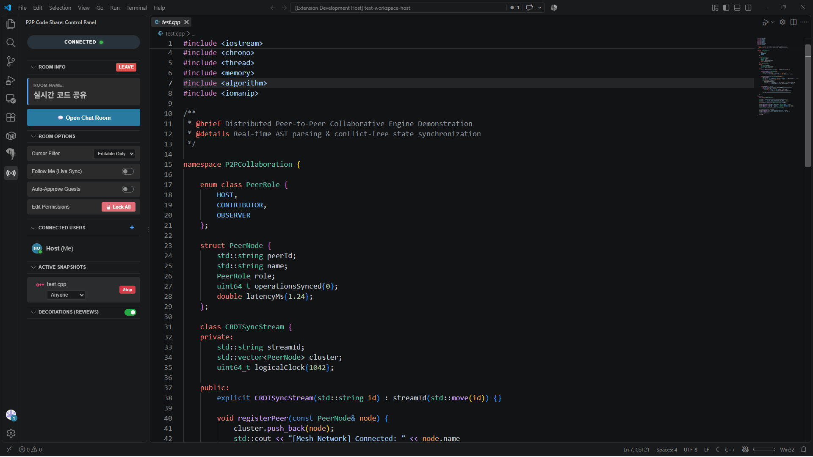  
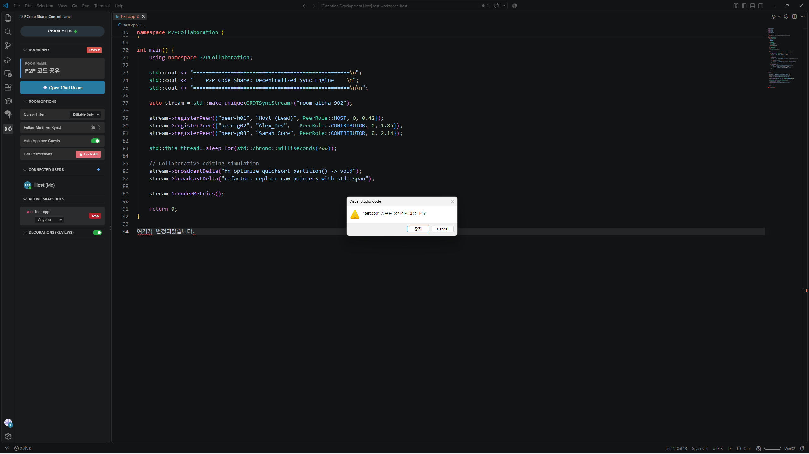  
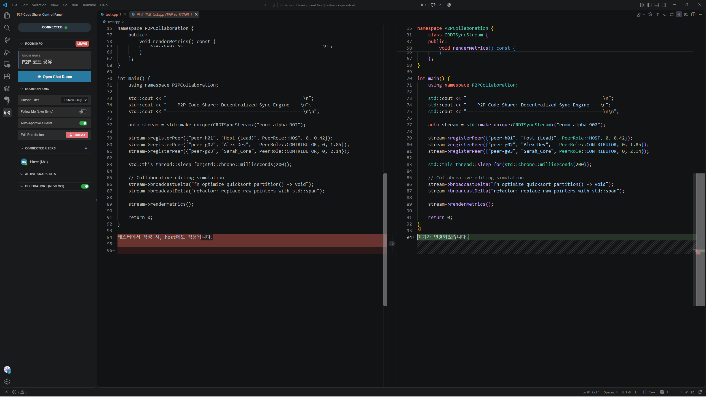

---

### 3. 방 참여하기 (게스트 - Guest)

1. **사이드바 열기**: 좌측 액티비티 바에서 **P2P Code Share** 아이콘을 클릭합니다.
2. **참여 선택**: **`Join Sharing Room`** 버튼을 누릅니다.
3. **정보 입력**:
   - **Host Room Name**: 호스트가 개설한 방 이름을 정확하게 입력합니다.
   - **Your Name**: 세션에서 사용할 본인의 닉네임을 입력합니다.
4. **접속 시작**: **`JOIN (AUTO)`** 버튼을 누르면 호스트에게 참여 요청이 전송되며 대기 상태로 전환됩니다.
5. **승인 후 자동 참여**: 호스트가 승인하면 호스트가 공유한 파일들이 로컬 임시 공간에 자동으로 복제 및 열리며 즉시 동시 편집에 참여할 수 있습니다.

> [!NOTE]
> **참여 요청 전송 시 주의사항**:
> 사용자의 네트워크 환경이나 시그널링 상태에 따라 게스트의 방 참여 요청이 호스트에게 한 번에 도달하지 못할 수 있습니다.
> 이 경우 내부적으로 연결을 자동으로 재시도하도록 설계되어 있으나, 네트워크 상태에 따라 연결 완료까지 다소 시간이 소요될 수 있습니다.

> [!TIP]
> **수동 연결 (Manual Mode)**: 네트워크 정책상 자동 시그널링이 차단된 환경에서는 **`Join (Manual)`**을 눌러 호스트가 `Invite Guest`로 생성한 연결 텍스트(SDP)를 직접 복사/붙여넣기하여 연결할 수 있습니다.

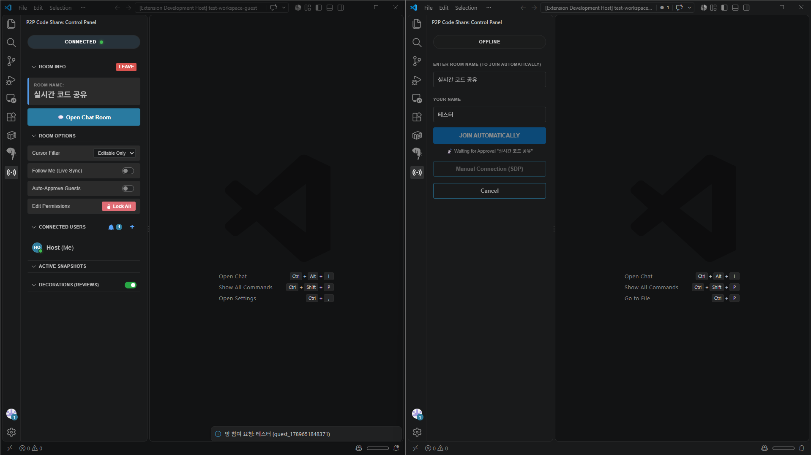  
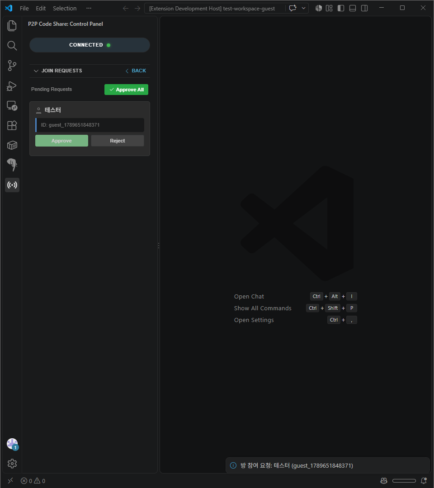  
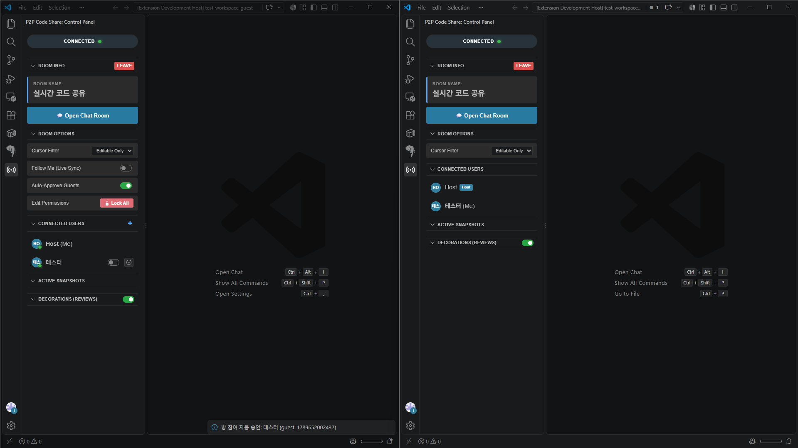

---

### 4. 참여자 승인 및 권한 관리 (호스트 전용)

- **참여 요청 승인 / 거절**:
  - 게스트가 접속을 요청하면 사이드바 상단에 알림 종 모양 버튼(`Requests`)이 표시됩니다.
  - 클릭하여 대기 중인 요청 목록을 열고 **`Approve(승인)`** 또는 **`Reject(거절)`**을 누릅니다.
  - 사이드바 옵션의 **`Auto Approve New Guests`**를 체크해 두면 요청 즉시 자동으로 승인됩니다.
- **쓰기 권한 제어 (Write Permission)**:
  - 사이드바의 **Participants** 목록에서 각 게스트 우측의 스위치를 켜고 끌 수 있습니다.
  - 스위치를 끄면 해당 게스트는 읽기 전용(`ReadOnly`) 모드가 되어 코드를 수정할 수 없습니다.
  - 상단의 **`Revoke All`** 버튼을 누르면 모든 게스트의 쓰기 권한을 한 번에 회수할 수 있습니다.
- **파일 담당자 지정 (File Ownership)**:
  - **Shared Files** 목록의 각 파일 드롭다운에서 특정 게스트를 담당자로 지정할 수 있습니다.
  - 담당자가 지정된 파일은 호스트와 해당 담당자만 편집할 수 있어 역할 분담 개발에 유용합니다.
- **강제 퇴장 (Kick)**:
  - 참가자 이름 우측의 마이너스(`-`) 버튼을 누르면 해당 사용자를 방에서 즉시 퇴장시킵니다.

> [!CAUTION]
> **권한 제어 시 주의사항**:
> 1. **파일 담당자 우선권**: 파일에 특정 담당자(Owner)가 지정되면, 게스트의 전체 쓰기 권한 스위치가 켜져 있더라도 **호스트와 해당 담당자 외의 다른 모든 게스트는 읽기 전용으로 제한**됩니다.
> 2. **강제 퇴장 처리**: 호스트가 게스트를 퇴장(`Kick`)시키면 즉시 WebRTC 연결이 차단되고, 해당 게스트의 로컬 에디터에서 임시 파일이 자동으로 닫히며 디스크에서 삭제됩니다.

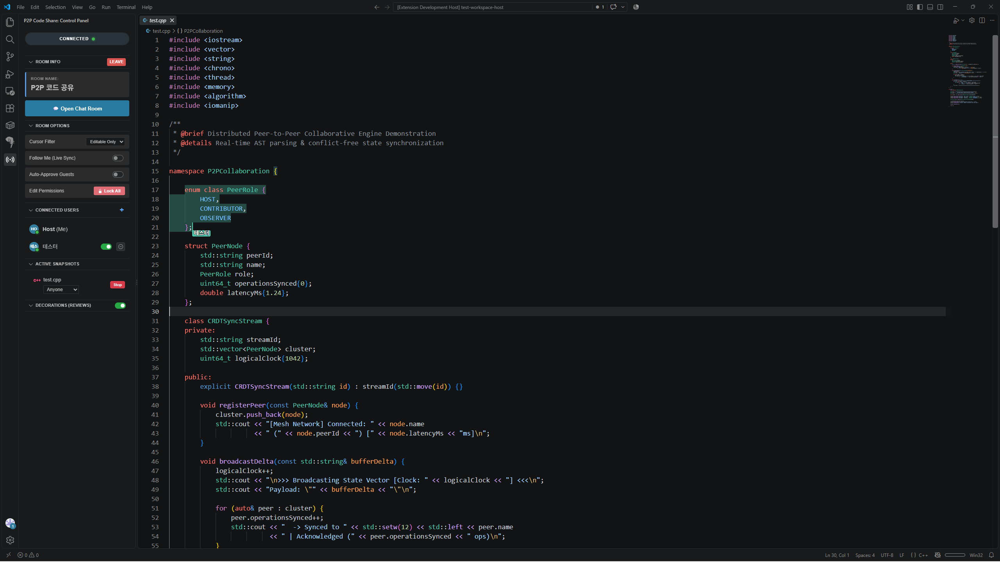  
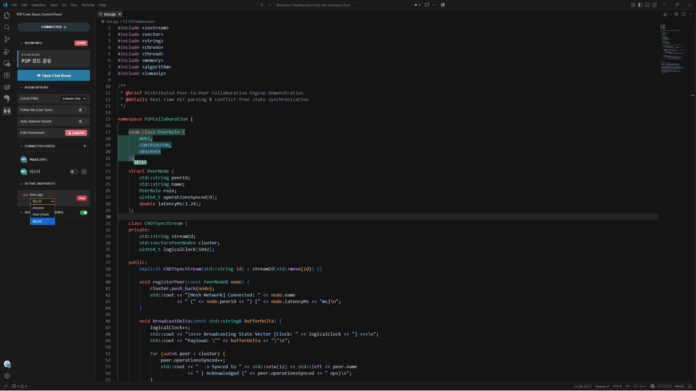

---

### 5. 협업 도구 활용하기

- **호스트 화면 팔로우 모드 (Follow Me)**:
  - 호스트가 사이드바의 **`Follow Me`** 체크박스를 활성화하면, 호스트가 파일을 전환하거나 스크롤/커서를 이동할 때 게스트들의 에디터 화면도 동일한 위치로 실시간 추적 동기화됩니다.
- **실시간 인앱 채팅 (P2P Chat)**:
  - 사이드바 상단의 **말풍선(Chat)** 아이콘을 클릭하여 실시간 채팅 창을 열 수 있습니다.
  - 새 메시지가 도착하면 사이드바 아이콘에 안 읽은 메시지 카운트 배지가 표시됩니다.
- **코드 위치 메모 / 북마크 (Decorations)**:
  - 에디터에서 중요한 코드 라인을 선택한 뒤, 명령 팔레트(`Ctrl+Shift+P` / `Cmd+Shift+P`)에서 **`P2P: Add Bookmark / Memo`**를 실행합니다.
  - 사이드바 **Decorations** 목록에 등록되며, 메모를 클릭하면 해당 파일 및 코드 라인으로 즉시 점프합니다.
  - 작성자 공개 범위를 '모두(Everyone)' 또는 '호스트 전용(Host Only)'으로 설정할 수 있습니다.
- **커서 표시 필터링**:
  - 사이드바의 **Cursor Filter** 드롭다운(`All`, `Host Only`, `Editable Only`)을 통해 화면에 표시되는 다른 사용자의 원격 커서 수를 조절할 수 있습니다.

> [!NOTE]
> **협업 도구 사용 시 참고사항**:
> 1. **팔로우 모드 포커스 주의**: 호스트가 빠르게 파일을 넘나들거나 스크롤할 경우 게스트의 화면도 즉시 강제 전환되므로, 게스트가 코드를 작성 중일 때 입력 포커스를 뺏길 수 있습니다. 따라서 코드 리뷰나 설명 단계에서 활성화하는 것을 권장합니다.
> 2. **데코레이션 가시성**: `Host Only`로 등록된 메모는 게스트 화면에는 전혀 노출되지 않습니다. 대량의 코드가 추가/삭제될 경우 메모의 라인 인덱스가 약간 어긋날 수 있습니다.
> 3. **채팅 기록 휘발성**: P2P 통신 특성상 중앙 DB에 저장되지 않으므로, 방 세션을 완전히 종료(`Leave Room`)하면 채팅 내역은 자동으로 초기화됩니다.

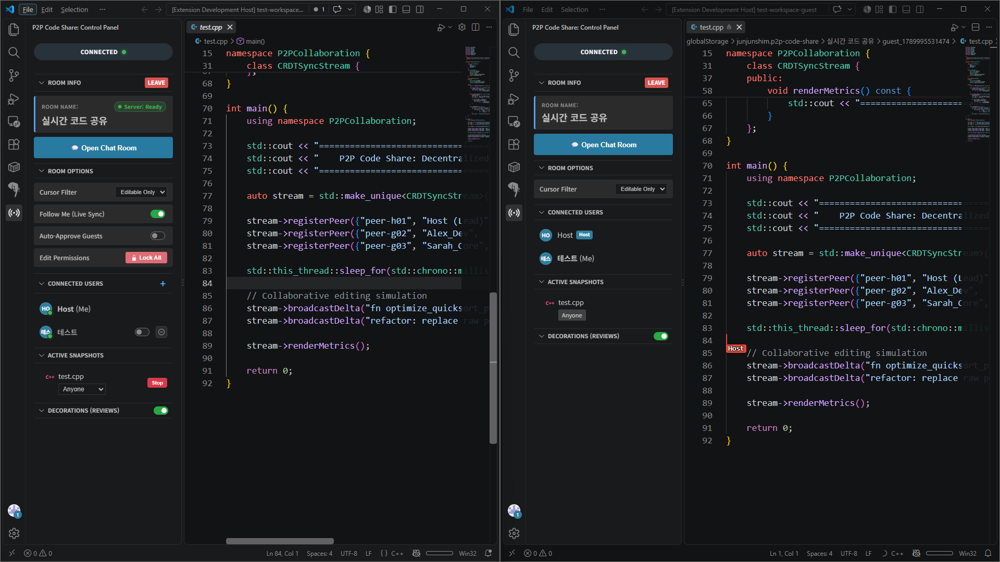  
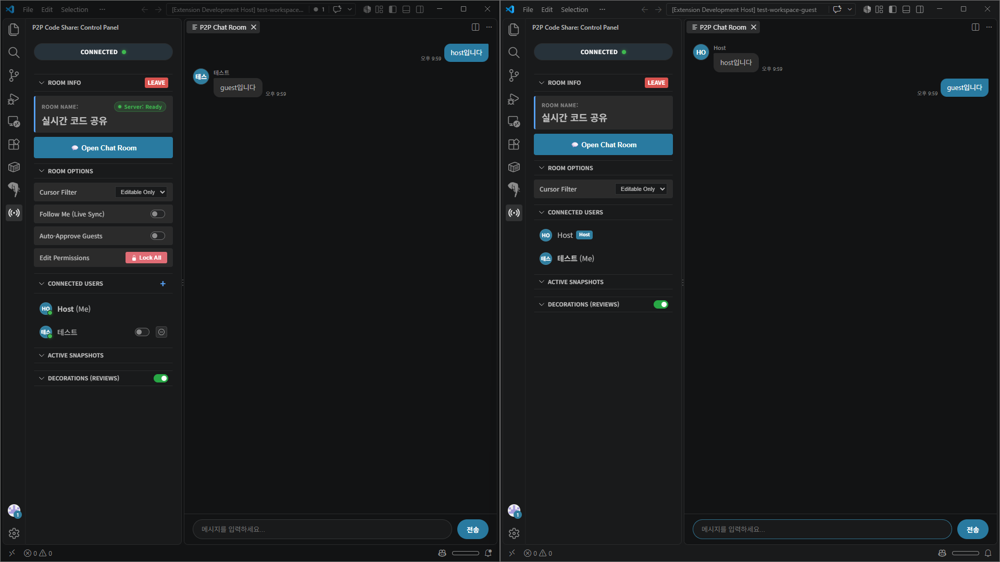  
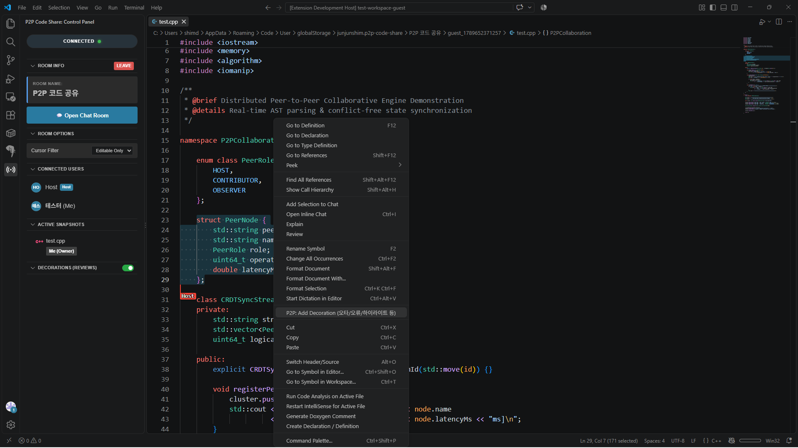  
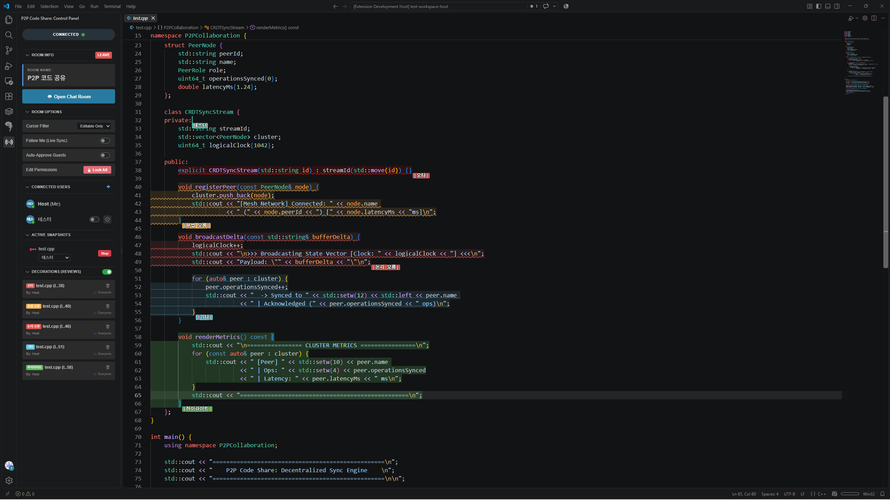  
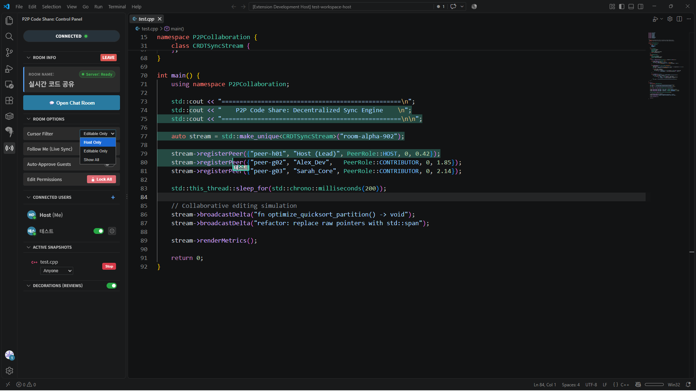

---

### 6. 연결 상태 모니터링 & 세션 복원

- **연결 상태 점 (호스트 화면)**:
  - 참여자 아바타 하단에 초록 점(`Connected`) 또는 핑 응답 지연 시 노란 점(`Reconnecting`)이 표시됩니다.
- **호스트 폴더 전환 시 세션 복원**:
  - 호스트가 VS Code에서 작업 폴더를 변경하거나 창을 새로고침해도 방과 공유 파일, 참여자 목록이 자동 복원됩니다.
  - 게스트 화면에는 **`호스트 작업 공간 전환 중... 재연결 대기 중`** 배너가 뜨며 30초 유예 기간 동안 에디터가 안전하게 보호된 후 자동 재연결됩니다.

> [!NOTE]
> **세션 복원 및 재연결 유예 기간(30초 타임아웃)**:
> 1. **게스트 유예 시간**: 호스트가 창을 전환할 때 게스트는 오프라인 충돌을 막기 위해 에디터가 일시 잠금(`ReadOnly`)되며, **최대 30초 동안 호스트에게 재연결을 시도**합니다. 30초가 지나도 호스트가 온라인으로 복귀하지 않으면 세션이 안전하게 자동 종료됩니다.
> 2. **호스트 미응답 게스트 자동 정리**: 호스트 복원 후 게스트가 VS Code를 닫았거나 네트워크 문제로 재연결되지 않을 경우, **호스트는 30초간 대기한 후 사용자 목록에서 해당 게스트를 자동으로 삭제**하여 깨끗한 상태를 유지합니다.

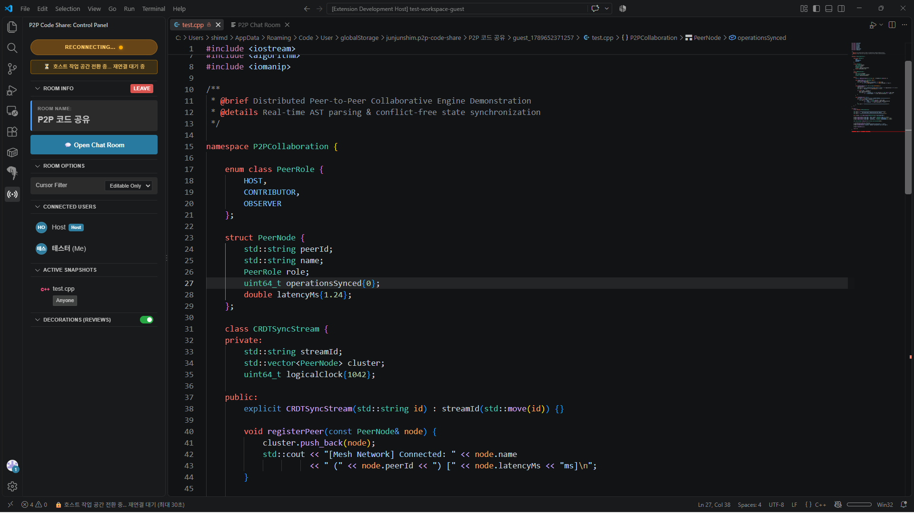

---

### 7. 방 나가기 및 종료 (Leave Room)

- **호스트**: 사이드바 하단의 **`Leave Room`**을 누르면 모든 게스트와의 연결이 해제되고 방이 안전하게 닫힙니다. (공유 파일이 열려있는 경우 먼저 공유를 중지해야 합니다.)
- **게스트**: **`Leave Room`**을 누르면 로컬에 복제되었던 임시 파일들이 디스크에서 깔끔하게 정리되고 세션이 종료됩니다.

> [!CAUTION]
> **퇴장 시 주의사항**:
> 1. **호스트 방 종료 조건**: 호스트는 **공유 중인 파일(`Shared Files`)이 1개라도 남아있으면 방을 나갈 수 없습니다.** 반드시 모든 파일의 공유를 중지(`Stop`)한 후 `Leave Room`을 실행해야 합니다.
> 2. **세션 일괄 종료**: 호스트가 방을 나가면 방 자체가 폐쇄되므로 연결되어 있던 모든 게스트의 세션도 즉시 함께 종료됩니다.

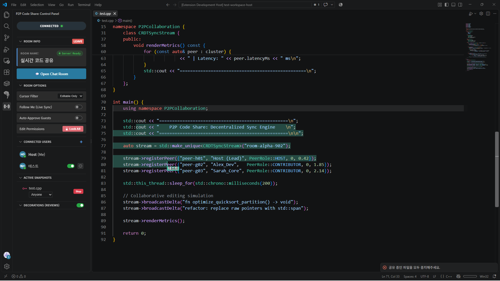  
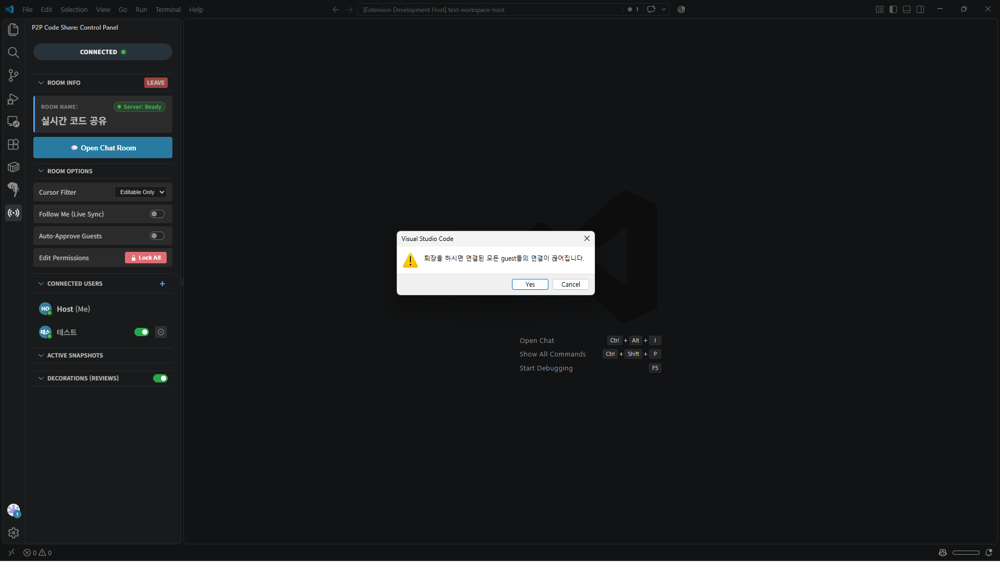

---

### 8. 외부 네트워크/방화벽 환경 설정 (TURN Server)

서로 다른 네트워크(LTE, 타사 Wi-Fi, 기업망) 간 연결이 원활하지 않은 경우 TURN 서버를 설정합니다:

1. VS Code 설정(`Ctrl+,` / `Cmd+,`)에서 `p2pCodeShare`를 검색합니다.
2. `settings.json`에 TURN 서버 정보를 입력합니다:
   ```json
   {
     "p2pCodeShare.turnUrl": "turn:your-turn-server.com:3478",
     "p2pCodeShare.turnUsername": "your_username",
     "p2pCodeShare.turnCredential": "your_password"
   }
   ```
3. TURN 연결이 성공하면 상단 상태 배지에 **`CONNECTED (TURN)`**으로 표시됩니다.

> [!TIP]
> **TURN 사용 시 팁**:
> TURN 서버는 P2P 직접 홀펀칭이 불가능할 때 모든 WebRTC 데이터 패킷을 중계하므로, 무료 오픈 TURN 서버를 사용할 경우 제공 업체의 일일/월간 트래픽 한도를 초과하지 않도록 주의해 주세요.

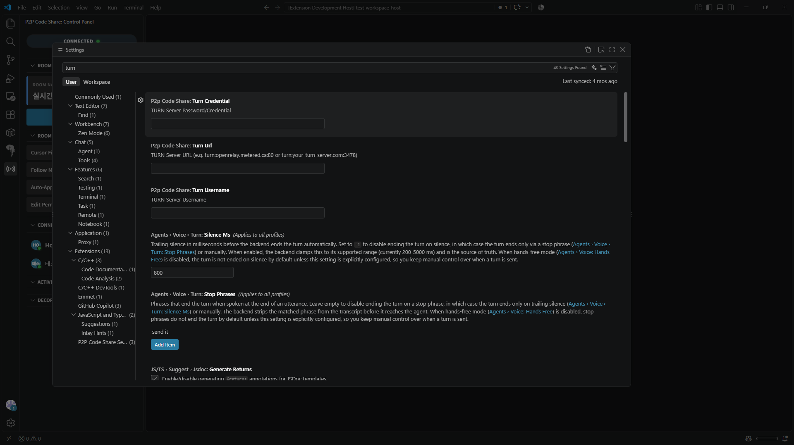
